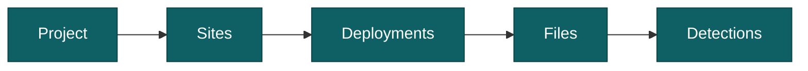

import AppShot from "@site/src/components/AppShot";

# How a project is organised

A project stores your data in a hierarchy. Two of the words in it are new to most people, site and deployment, and those two are what the map, the trap nights and the rates are built on.

A folder run has neither. It works on one folder and keeps no structure of its own. See [choose a workflow](../start-here/choose-a-workflow.mdx).

## The levels



- **Project**: the whole study, holding all its sites and their data.
- **Site**: a physical camera location, with coordinates. It stays put.
- **Deployment**: one period a camera was recording at a site, backed by a folder of files.
- **File**: an image or video, with its capture time.
- **Detection**: an animal, person, or vehicle found in a file, with a species label once classified.

## Site or deployment

A site is where. A deployment is when.

The site is the spot in the field and it does not move. The deployment is one stretch of time a camera stood there. So a site you visit every season builds up one deployment per season, all of them sharing the same coordinates.

Keeping them apart is what makes your numbers comparable. The site gives the map its position. The deployments give it the effort, which is what turns 40 observations into a rate per 100 trap nights.

<AppShot name="sites" />

## How many deployments is one camera?

The usual case: one camera at one spot, collected a few times over a season, all of it in one folder with a subfolder per pickup. Is that one deployment, or several?

Both work. The effort comes out right either way, as long as each camera period sits in its own subfolder. AddaxAI measures every subfolder on its own and adds them up, so the weeks the camera was not out are never counted. What it cannot work with is several periods poured into one flat folder. That reads as a single long stretch, gap included. See [how trap nights are counted](./trap-nights.md).

One thing does want them split. [Camtrap DP](../reference/exports.md#camtrap-dp) expects one camera period per deployment, so split the folder if you plan to share or archive in that format.

You do not have to decide up front. Add the folder, look at the results, and split later on the Deployments page. The split follows the folder hierarchy, and your images and videos stay where they are on disk.

## Paired cameras

Some cameras are dependent on each other: one animal passing triggers more than one of them. Two cameras facing each other across a trail, a camera at each end of a wildlife bridge or tunnel, or several cameras around one waterhole. Counted as separate deployments they would double the events, the counts and the effort. In AddaxAI, dependent cameras are one deployment with "Paired cameras" ticked.

Put each camera's files in its own subfolder under one folder for the deployment. If the cameras are stored elsewhere, move or copy their folders together first:

```
november-pickup/
├── cam1/
│   ├── IMG_0001.JPG
│   └── IMG_0002.JPG
├── cam2/
│   ├── IMG_0001.JPG
│   └── IMG_0002.JPG
└── cam3/
    ├── IMG_0001.JPG
    └── IMG_0002.JPG
```

Add `november-pickup` as one deployment on the Process page, open "Options" and tick "Paired cameras". The CSV import has a `paired_cameras` column for the same thing.

<AppShot name="pairedCameras" />

What the tick changes:

- **Events.** Files from all cameras are grouped by time, as if they came from one camera. An animal that passes the cameras is one event, with the files of every camera in time order.
- **Observations.** The count of an observation is the largest number seen in any single file, so the same animal seen by more than one camera is counted once.
- **Trap nights.** The deployment counts once. Two cameras that both ran 1 to 15 August give 15 trap nights, not 30.

Each camera can get its own time shift in the Adjust dates window. Tick "Paired cameras" first, the camera dropdown only shows after that. See [capture times](./capture-times.md#paired-cameras). In the event view each frame shows its camera.

Without the tick, AddaxAI reads subfolders as separate cameras or card periods and adds their effort up. See [how trap nights are counted](./trap-nights.md#deployments-with-subfolders).

Forgot the tick, or ticked it by mistake? Change it later on the Deployments page under Edit. AddaxAI regroups the deployment's events and reprocesses the labels; confirmed counts on events that change are reset, so do this before you start checking counts.

<AppShot name="deployments" />

## A deployment without a site

The site is optional. A deployment without one is analysed like any other and counts in every species total. It only has no position, so it stays off the map. Add the site whenever you like, on the Deployments page, and nothing is analysed again.

For how to add sites and deployments, see [build a project](../guides/build-a-project.mdx).
