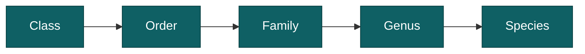

# Species names and taxonomy

How AddaxAI names the animals it finds, how those names are organised, and how to add one it does not know.

## Two names for the same animal

Every species has a common name and a scientific name. "Virginia opossum" and *Didelphis virginiana* are the same animal. You choose which one the app shows under View > Species names. It starts on common names. The choice changes the display only, never the data, and both names go into the exports in separate columns.

## Labels are grouped into a tree

Species are organised the standard way, from broad to specific:

So a red fox sits under mammalia > carnivora > canidae > vulpes > vulpes vulpes. The filter on the Labels and Insights pages uses this tree, so picking "carnivora" selects every carnivore at once, instead of ticking twenty species by hand.

## When you see a group instead of a species

Sometimes a label is a family or an order rather than a species, for example "felidae" or "aves". That means the model was not sure enough about any single species, so it gave you the group instead. You can relabel these to a species yourself if you can tell them apart. See [how labels get cleaned up](./label-cleanup.md).

## When you see "animal"

The box was found but never given a species. Two reasons:

1. The project has no species model, only a detector.
2. The detection scored below the classification gate, so it was never sent to the species model.

These still count as animals in the totals. They just have no species. See [confidence and verification](./confidence-and-verification.md).

## Adding your own label

Every model recognises a fixed list of species, which you can look up in the [model zoo](../reference/model-zoo.mdx). If the animal you need is not on that list, you can add it yourself. On the Labels page, select the detections, start a relabel, and type the name. When nothing matches, the picker offers to add it as a new label.

Next you can give it a taxonomy, which is optional. The GBIF lookup searches an online species database and fills in the class, order, family and genus for you, so your label slots into the tree next to everything else and the group filters pick it up. Scientific names find the best matches. A label like "bait" does not need a taxonomy at all.

Your label behaves like any other from then on: you can filter on it, count it, and export it. The one thing it does not do is teach the model. The AI cannot predict a label it was never trained on, so on the next analysis you will have to apply it by hand again.
